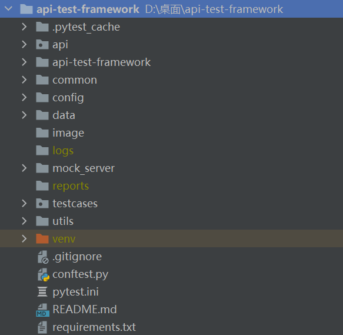
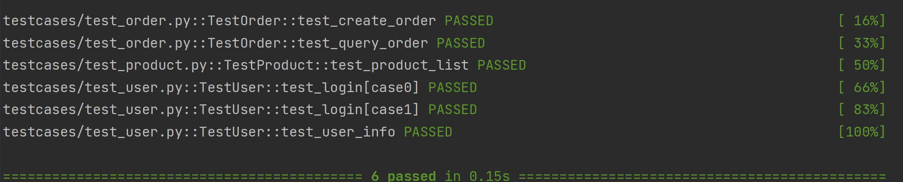
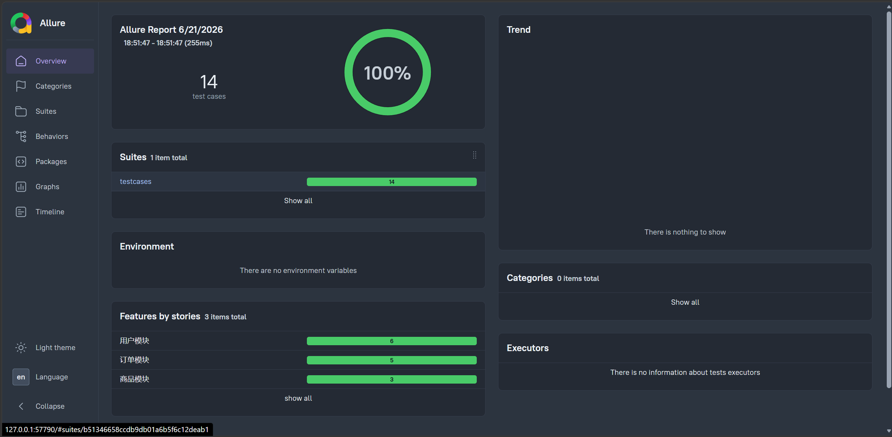

# API Test Framework

基于 Pytest + Requests + YAML + Flask 构建的接口自动化测试框架，实现用户、商品、订单模块的自动化测试，支持 Token 管理、数据驱动测试、日志记录等功能。

---

## 技术栈

- Python 3.10
- Pytest
- Requests
- Flask
- PyYAML
- Logging


---

## 项目功能

### 用户模块

- 用户登录
- Token获取
- 用户信息查询

### 商品模块

- 商品列表查询

### 订单模块

- 创建订单
- 查询订单

### 测试框架能力

- BaseAPI统一请求封装
- YAML数据驱动
- Token自动管理
- 日志记录
- 配置文件管理
- Mock Server模拟后端接口

---


## 项目结构

```text
api-test-framework
│
├─ api
│   ├─ base_api.py
│   ├─ user_api.py
│   ├─ product_api.py
│   └─ order_api.py
│
├─ common
│   └─ token_manager.py
│
├─ config
│   ├─ config.yaml
│   └─ env.py
│
├─ data
│   └─ login.yaml
│
├─ mock_server
│   └─ app.py
│
├─ testcases
│   ├─ test_user.py
│   ├─ test_product.py
│   └─ test_order.py
│
├─ utils
│   ├─ logger.py
│   ├─ yaml_util.py
│   └─ assert_util.py
│
├─ logs
├─ reports
├─ pytest.ini
├─ requirements.txt
└─ README.md
```
---
## 项目亮点

- 基于 Pytest + Requests 封装通用接口请求层，实现业务接口与测试逻辑解耦
- 使用 YAML 实现测试数据与代码分离，支持数据驱动测试
- 使用 TokenManager 实现接口依赖处理，自动维护登录态
- 使用 Logging 记录请求与响应日志，便于问题排查
- 基于 Flask 搭建 Mock Server，模拟用户、商品、订单业务接口
- 框架支持快速扩展新的业务模块和测试用例
---
## 项目成果

- 完成用户、商品、订单三大核心模块接口自动化测试
- 编写自动化测试用例 10+（根据实际数量填写）
- 实现登录→获取用户信息→创建订单→查询订单完整业务链路验证
- 搭建可复用接口自动化测试框架，提高测试用例开发效率
---

## 环境安装

### 1. 克隆项目

```bash
git clone https://github.com/你的GitHub用户名/api-test-framework.git
```

### 2. 进入项目目录

```bash
cd api-test-framework
```

### 3. 安装项目依赖

```bash
pip install -r requirements.txt
```

### 4. 验证安装

```bash
pytest --version
```

成功后会显示 Pytest 版本信息。

---

## 启动 Mock Server

在项目根目录执行：

```bash
python mock_server/app.py
```

启动成功后会看到：

```text
* Running on http://127.0.0.1:5000
```

此时 Mock Server 已启动，可以进行接口测试。

---

## 执行测试

### 执行全部测试用例

```bash
pytest -v
```

### 执行用户模块测试

```bash
pytest testcases/test_user.py -v
```

### 执行商品模块测试

```bash
pytest testcases/test_product.py -v
```

### 执行订单模块测试

```bash
pytest testcases/test_order.py -v
```

### 显示详细日志

```bash
pytest -v -s
```

测试通过示例：

```text
testcases/test_user.py::TestUser::test_login PASSED
testcases/test_user.py::TestUser::test_user_info PASSED
testcases/test_product.py::TestProduct::test_product_list PASSED
testcases/test_order.py::TestOrder::test_create_order PASSED
testcases/test_order.py::TestOrder::test_query_order PASSED
```

## 项目截图

### 项目结构



### 测试执行结果



## Allure测试报告




